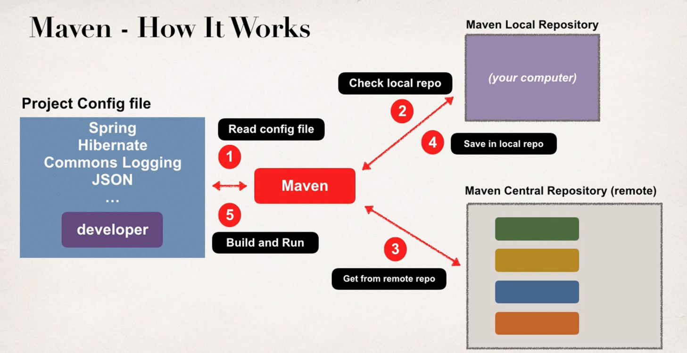
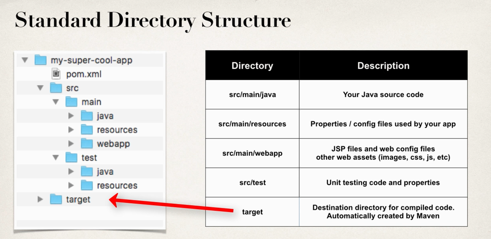

# Maven
- Maven is project management tool
- Used for build management and dependencies.

# What problem it solves?
- When you build java project , it needs additional JAR file eg : spring , hibernate , JSON etc.
- without Maven , you would have to down jars and add it in compile path
- With Maven, you add dependencies  , maven will go add and download JAR and make them available while compile/run.
- It will download everything from Maven central repo.

# How it works
- It reads config from your project config file
- Checks your local Maven repo.
- If it is not on local then it will  take it from Maven central repo.(remote)
- Saves it in local repo.
- and then Build/run the project.

## Note : it will also download any other sub-dependency of a dependency as well.

- Maven will handle class/build path for you.
- Based on config file, Maven will add JAR files accordingly.

## Advantages of Maven
- Dependency Management
    -  Maven finds you JAR for you
    - no more missing jar

- Building and Running your project
    - No more build path/ class path issues

- Standard directory structure

