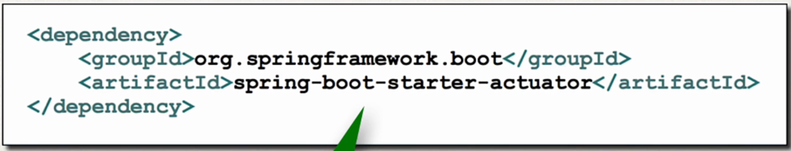

# Spring boot actuator
- Exposes endpoints to monitor and manage your application
- Devops functionalities out of the box
- Simply by adding dependency to your POM file
- REST endpoints are automatically added to your application
- Automatically exposes the endpoint for metrics out of the box
- End point are prefixed with /actuator 
- eg: /health - health information about your application
- 

## Health endpoint
- /health checks the status of the application
- Normally used to monitor apps to see if your app is up or down
- eg : localhost:8080/actuator/health

## Note : To expose other endpoints
- By default only /health is exposed
- The /info can provide more info 
- To expose others
            
            File: src/main/resources/application.properties
            management.endpoints.web.exposure.include = health,info // providing , delimited list
            management.info.env.enabled = true

## info endpoint
- /info gives information about your app
- Default is empty eg : need to customize

#### how to do this?
- Update application.properties with your app info

        info.app.name = My super cool app
        info.app.description = A crazy and fun app
        info.app.version = 1.0.0
- Anything starting with info will be used by /info

## To expose all the endpoints

    management.endpoints.web.exposure.include = *

#### For getting list of beans
- ../actuator/beans

### Exclude endpoints

      management.endpoints.web.exposure.exclude = health,info