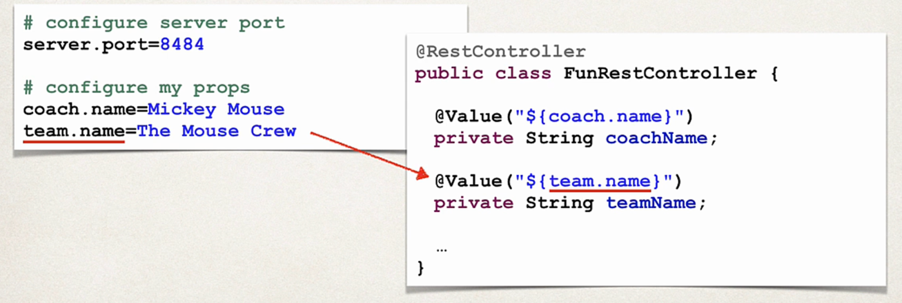

# Application properties
- By default, SpringBoot will load properties from : application.properties
- It is created by default
- We can different properties like : 

                    server-port= 8585
Or some custom properties 

                    mickey-house= clubhouse

## how to read properties

## Static directory 
- It stores the static data for the application

### Warning : Don't use the src/main/webapp directory if your application is packaged as JAR
### Although it is standard Maven directory , it only works with WAR
### It is silently ignored if it is JAR.