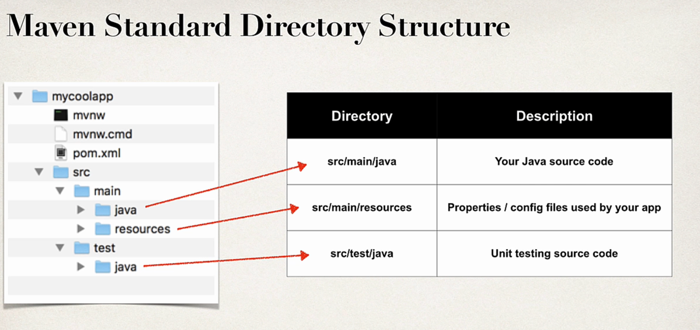
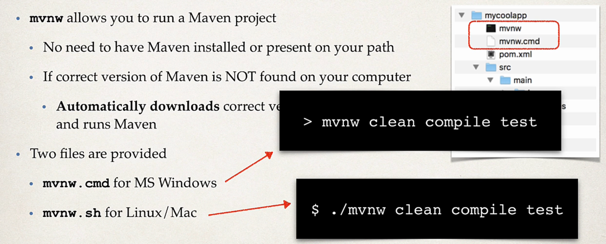
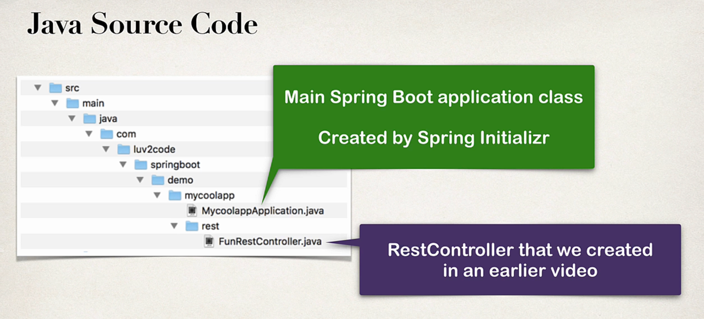

# Maven Standard Directory Structure

# Maven Wrapper files
- mvnw allows you to run a Maven project
- No need to install Maven or have it present on the path
- If correct version is not found , automatically downloads correct version and to run maven.
- Two files are provided
- mvnw.cmd for windows
- mvnw.sh for linux/mac

- pom.xml includes  info that you entered at Spring initializer website.

### How to package and run
- If Maven is installed on system then mvn or if not then to use maven of the project ./mvnw

- mvn package
- mvn spring-boot:run
