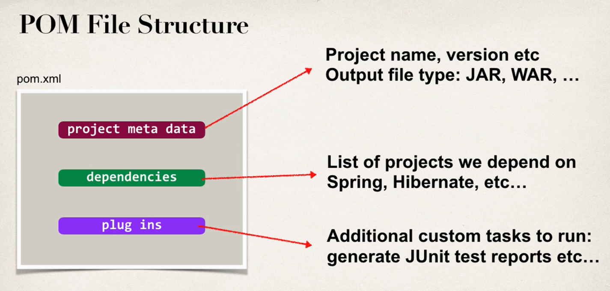
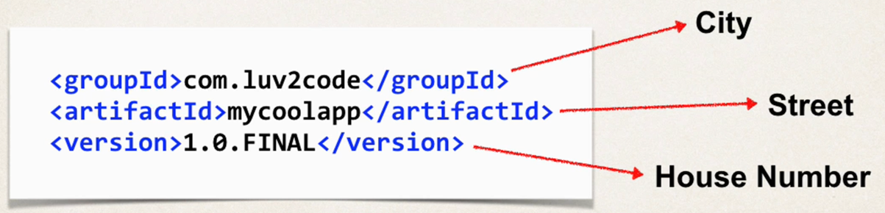
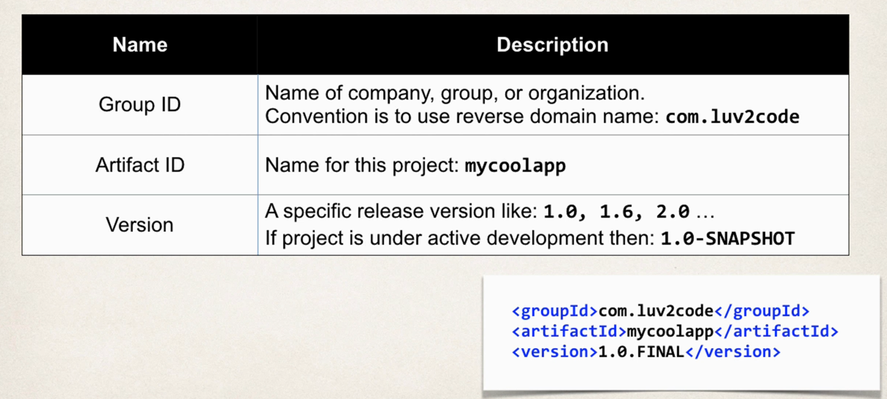
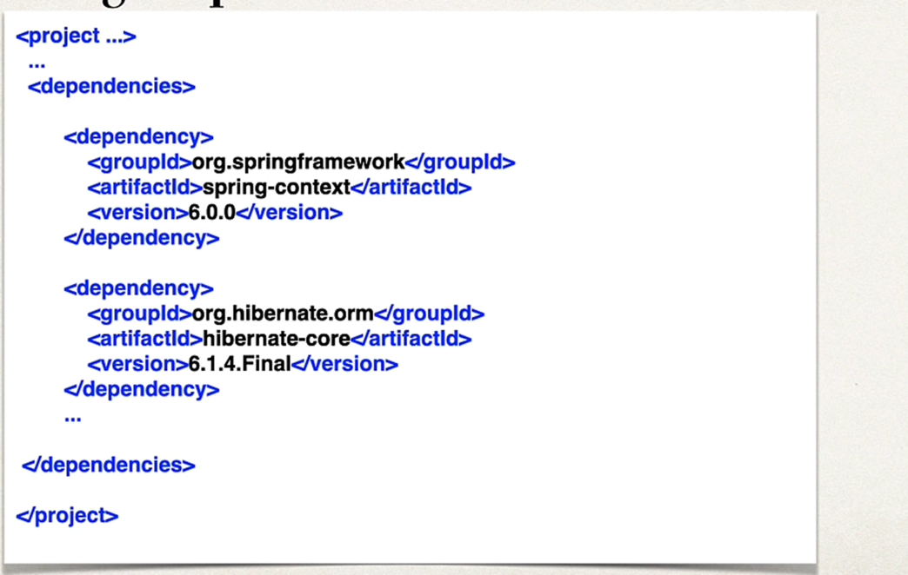

# Maven key concepts
- POM file - pom.xml
- Project Coordinates

## POM file
- Project Object file: POM file
- Configuration file for your project (Basically your shopping list).
- Located in root of your Maven Project

## Project Coordinates
- It uniquely identify a project.
- Similar to GPS coordinates for your house : latitude / longitude
- Precise information for finding your house (city, street , house #)

## Note : Snapshot means that project is still under development.

## Simple to add dependency 

## Dependency Coordinates
- we need group ID , artifact ID
- Version is optional.
- Best practice is to include version (Repeatable builds for Devops) 

## Ways to find dependency coordinates
- Visit the project pages( spring.io, hibernate.org etc)
- Visit https://central.sonatype.com (easiest approach)