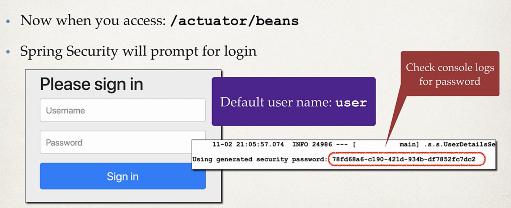

# Spring Security
- We dont want to expose every endpoints
- Therefore we add spring security to the project and endpoints are secured

		<dependency>
			<groupId>org.springframework.boot</groupId>
			<artifactId>spring-boot-starter-security</artifactId>
		</dependency>

- when we add spring security and access /actuator/beans
- It will ask for the user and password
    

## If we want to generate your own user
- you can do that by changing it in the properties 

          src/main/resources/application.properties

          spring.security.user.name = scott
          spring.security.user.password = tiger

- We can further change the security 
- Use db for roles,encrypted password etc
