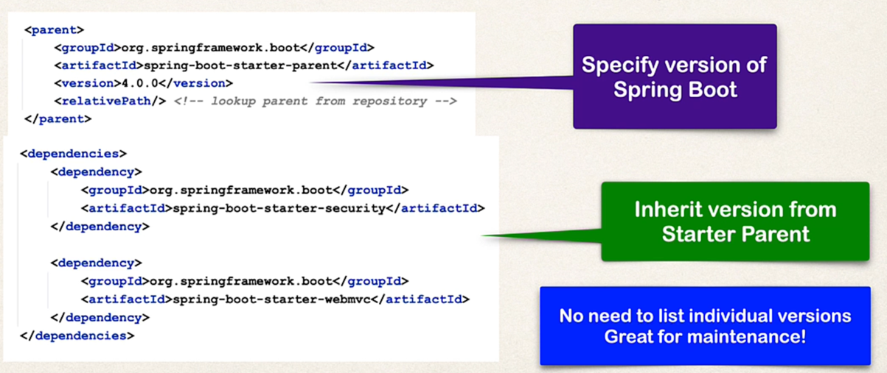

# Spring Boot starters
- A curated list of Maven dependencies
- A collection of dependencies grouped together.
- Makes it easier to start with spring.
- Reduces the amount of Spring/Maven config.
 
## For Example if you want to use Spring web MVC 
- You would have added multiple dependencies earlier.
- Now you can just add spring-boot-starter-webmvc
- It will manage all the dependencies like tomcat,json etc and their versions as well.

# Spring-Boot-starter-parent
- Spring provides a "Starter parent"
- This is a special starter that provides Maven default.
- Maven default are defined in Starter parent
- Default Compiler level, UTF-8 source coding and others.

## Note : 
- For spring-boot-starter-* , no need to list the version as it is handled from spring-boot-starter-parent

## Benefit of using spring boot starter parent
- Default Maven config : Java version , UTF-encoding etc
- Dependency management
  - Uses version on parent only
  - spring-boot-starter-* dependencies inherit version from parent
- Default configuration of Spring boot plugin