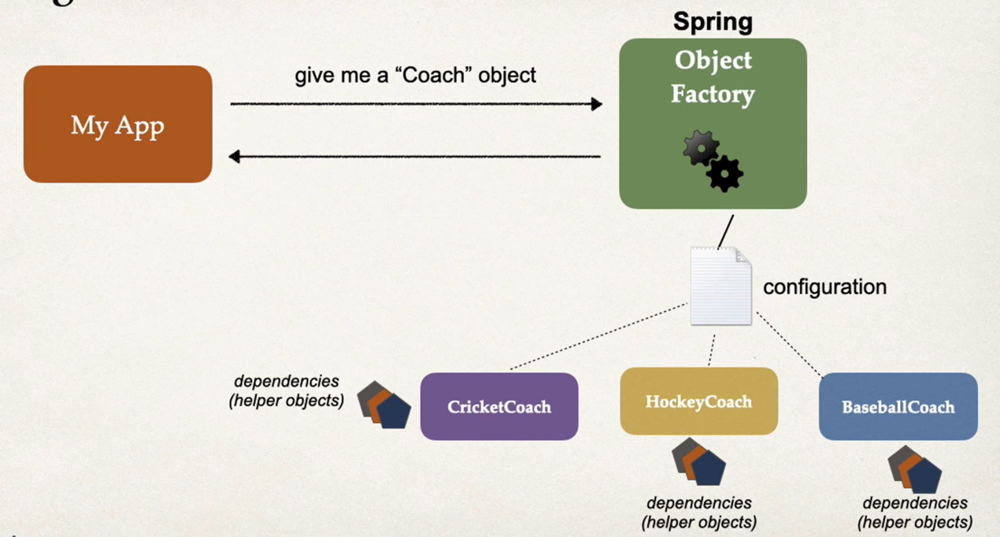

# Dependency Injection
- The client delegates to another object the responsibility of providing its dependencies.

- IOC is that factory provides us the object and based on config it gives us the coach
- But coach might have other coaching staff , those are added using dependency injection.

## Type of injection
- There are multiple type of injection
- Two recommended types of injection
  - Constructor Injection
  - Setter Injection

## When to use which injection
- Constructor Injection
  - Use this when you have required dependencies
  - Recommended as first choice

- Setter injection
  - use this when you have optional dependencies
  - If dependency is not provided, your app can provide reasonable default logic 

## What is AutoWire?
- For spring dependency , it can use autowire
- Spring looks for a class to match
- matches by type : class or interface
- Spring will automatically inject it therefore autowired

