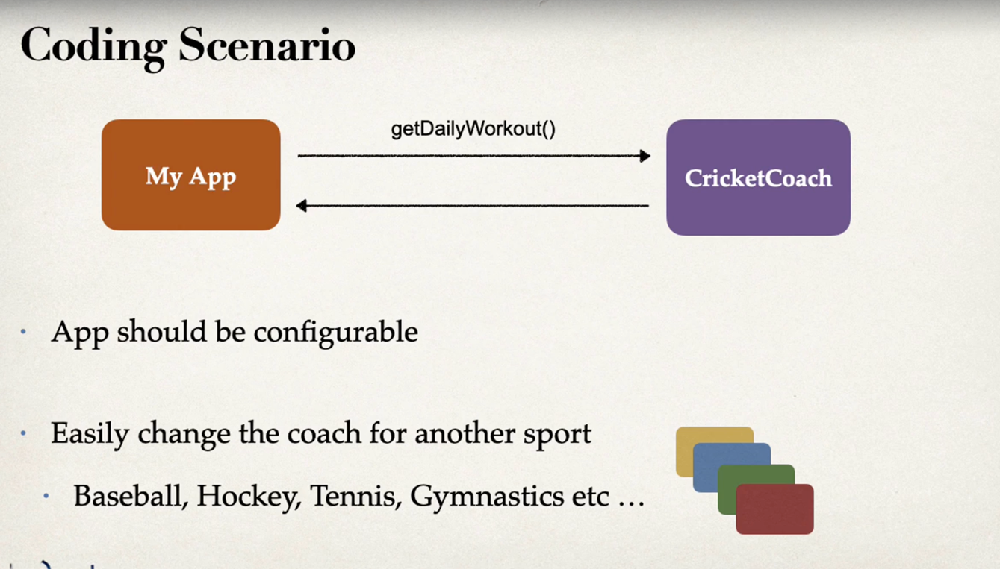
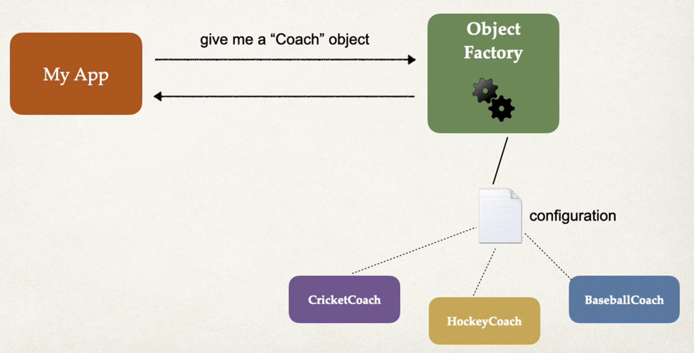

# Inversion of Control (IOC)
- The approach of outsource the construction and management of objects

### ideal solution 
- We ask to create a coach
- We have a object factory and based of configuration, it will give us our coach

### we use Spring container 

- Primary function :
- create and manage objects(Inversion of control)
- Inject object dependencies (Dependency Injection )

## Configuring Spring Container
- Java Annotations 
- Java source code