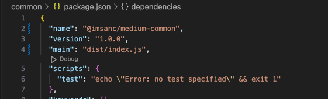

# Pre yarn based / mono repo days

We used to create common packages and we used to upload that to npm repo .
so that we can import that common files in our frontend as well as backend projects.

- first rename the project
- as well as change the main file path to dist foler 
-  "main": "dist/index.js",

# For typescript 

- If we want our compiler to generate ts files as well we need to set
  "declaration": true,   in the ts.config file
- that will generate "singin.d.ts" file which can be used in ts projects where we install  "xyz@types"

# .npmignore
As we want only to push our dist folder not the source code to the npm therefore we will ignore by src file 