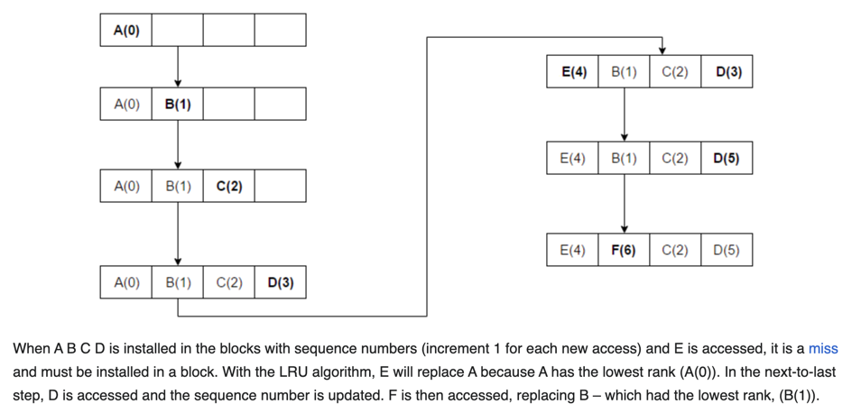

# Least Recently Used (LRU)

- This algorithm requires keeping track of what was used and when, which is cumbersome. 
- It requires "age bits" for cache lines, and tracks the least recently used cache line based on these age bits.
- When a cache line is used, the age of the other cache lines changes. 
- LRU is a family of caching algorithms, that includes 2Q by Theodore Johnson and Dennis Shasha and LRU/K by Pat O'Neil, Betty O'Neil and Gerhard Weikum.
