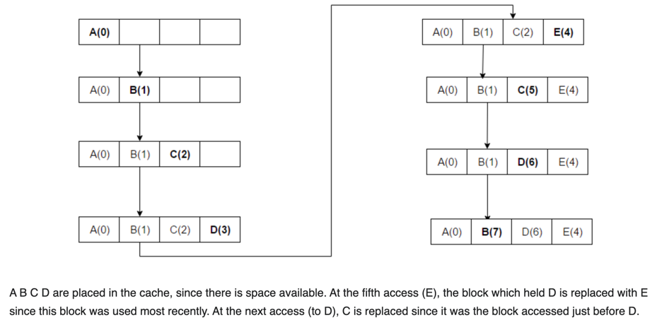

# MRU (Most Recently Used)
- MRU (Most Recently Used) is a cache eviction policy that removes the most recently accessed item first, when space is needed.
- It’s the opposite of LRU (Least Recently Used), which removes the item you haven’t touched in the longest time.

  ### 🔍 Why Would Anyone Use MRU?
  - MRU is useful when:
  - The most recently used item is least likely to be used again soon.

### This applies in specific scenarios, like:

🧭 1. Certain database queries
 - A user just fetched a huge result set.
 - Chances are, they won’t fetch that same data again immediately.
 - Better to keep older, smaller, frequently accessed data.

🎮 2. Large media or document access
- You open a large video or PDF.

The system might assume:
→ You won’t re-open it again soon.
→ But smaller documents you opened earlier might get reused (like daily reports).

🔁 3. Cyclic access patterns
For workloads that rotate through data — the last item accessed might not be needed again soon, but older items could come back.