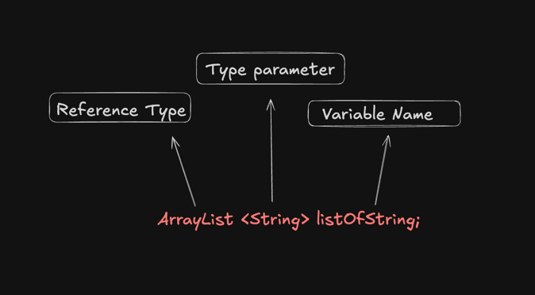

# Generic
- Generics enable us to create and design classes in a generalized manner ,without being concerned about the specific details of 
the elements they might contain.
- Examples : ArrayList is generic
- Java supports generic types , such as classes, records and interface. It supports generic methods 

### Declaring a Class vs Declaring a generic class

- The class declaration  has angle brackets with a T in them, directly after the class name.
- T is the placeholder for a type that will be specified later
- This is called a Type Identifier, and it can be any letter or word, but T is the short form of Type is commonly used.

-- Regular clas 

    class ITellyou {
        private String field;
    }

-- Generic class

    class YouTellMe<T> {
        private T field;
    }

