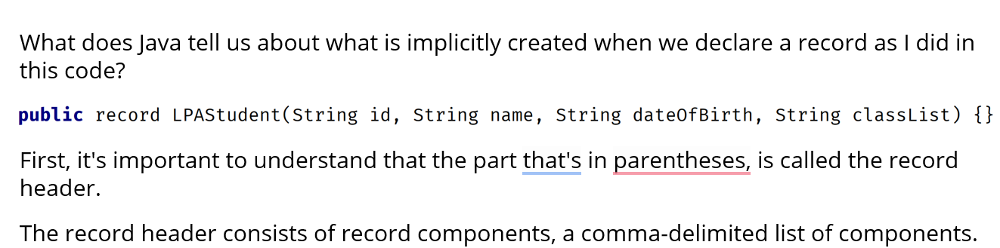
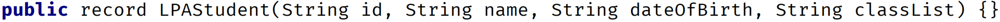

# The Record Type
- The record was introduced in JDK 14 and became officially part of Java in JDK 16.
- It's purpose is to replace the boilerplate code of the POJO but to be more restrictive.
- Java calls them "plain data carriers".

## What does Record do?
- The record is a special class that contains data that's not meant to be altered.
- In other words, it seeks to achieve immutability for the data in its members.
- It contains only the most fundamental methods, such as constructors and accessors.
- Best of all, you, the developer, don't have to write or generate any of this code.

## Implicit or Generated Code that Java provides

- For each component in the header, Java generates:
  - A field with the same name and declared type as the record component.
  - The field is declared private and final.
  - The field is sometimes referred to as a component field.

- Java generates a toString method that prints out each attribute in a formatted String.
- In addition to creating a private final field for each component, Java generates a public accessor method for each component.
- This method has the same name and type of the component, but it doesn't have any kind of special prefix like get or is, for example.
- The accessor method for id, in this example, is simply id().

## POJO Vs Record
- If you want to modify data on your class, you won't be using the record.
- You can use the code generation options for the POJO as I showed in the earlier video.
- But if you're reading a whole lot of records from a database or file source and simply passing this data around, then the record is a big improvement.

