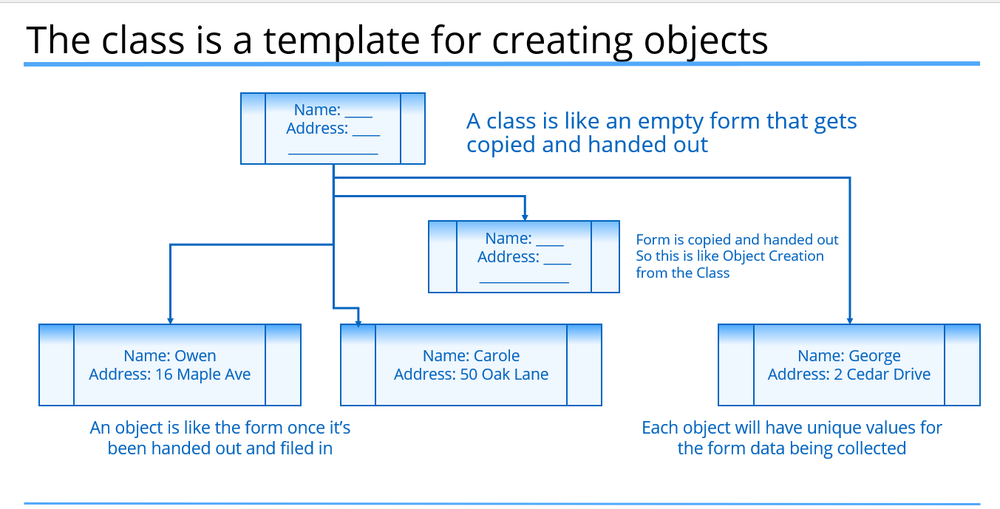
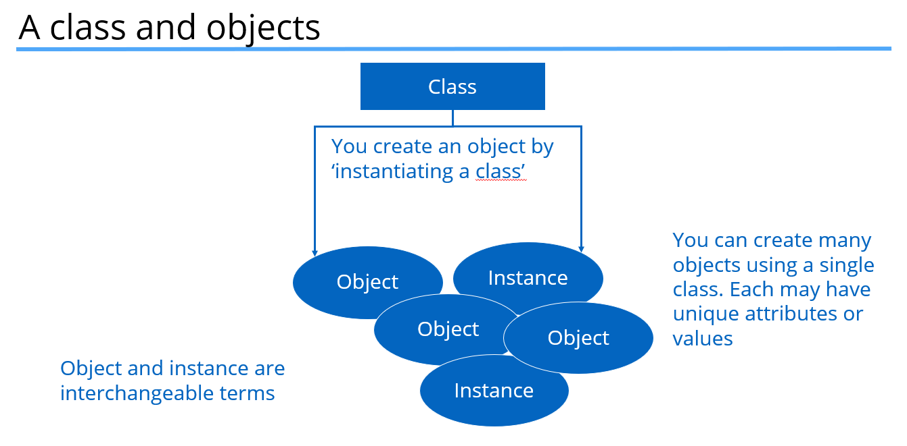
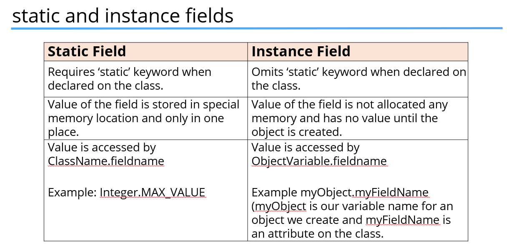
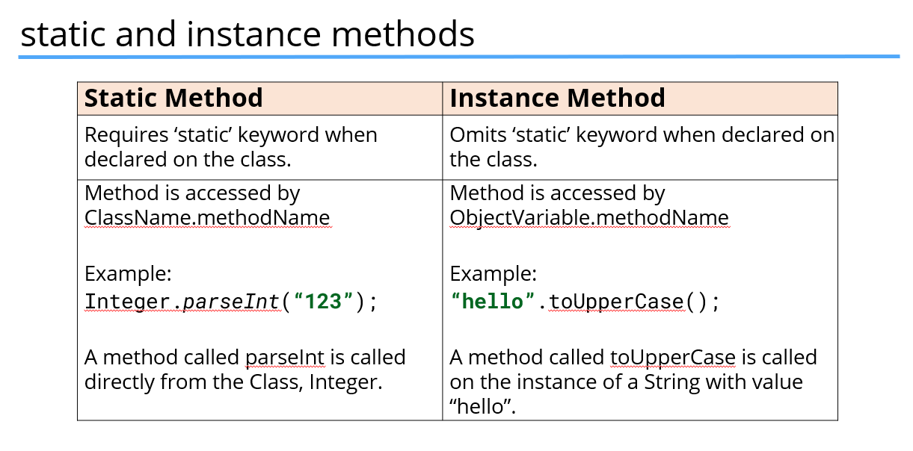

## Class

A class can be described as:
 - a custom data type.
 - a special code block that contains methods.

### Class can be defined as an empty form which is handed out , objects are the data that filled in a form creating an object

# Object
- An Object is called an instance of a particular class.

### Declaring and instantiating a new object from a class
- The most common way to create an object is to use the <b>new</b> Keyword.
- The new keyword creates an instance of class, and you can optionally pass data when creating that instance to set up data on that object.
- Looking at String , its actually a class. But is holds a special place in java language,
because we can create String just by using literals which we've seen.

## Difference between static and instance fields 

#### 🧠 Key Concept: When Are Static Fields Created?
- Yes, static fields are created and assigned memory even if the class hasn’t been instantiated (i.e., no objects of it are created yet).

#### 📦 How it works under the hood:
- Class Loading (by JVM):
    - When your program first references a class (e.g., accesses a static field or calls a static method), the JVM loads the class into memory (this is called class loading).

- Class Initialization:
  - After loading, the JVM initializes all the static fields (and runs static blocks if any). 
  - This happens only once per class during the program’s life.

- No need to instantiate the class:
  - Static fields exist independently of object creation.

### Example 
    public class Example {
    static int count = 10;
    
        static {
            System.out.println("Static block executed");
        }
    
        public Example() {
            System.out.println("Constructor called");
        }
    
        public static void displayCount() {
            System.out.println("Count is: " + count);
        }
    }
    
    public class Main {
        public static void main(String[] args) {
            Example.displayCount();  // ✅ No object creation
        }
    }

    Output:
    Static block executed
    Count is: 10

#### 🗂️ Memory-wise:
 - Static fields live in the Method Area (part of JVM memory).
 - Instance fields live in the Heap (when objects are created).

### Same goes on with static and initiated methods as well.
