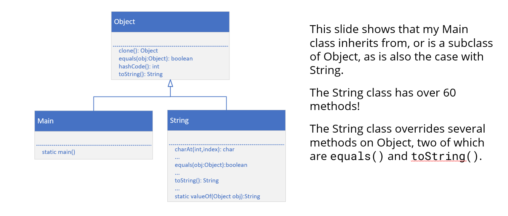

# java.lang.Object
- This is because every class you create in Java actually extends a special Java class.  
- class is named Object, and it's in the java.lang package.
- Ok, that's confusing, a class called Object?
- Let's see what Java has to say about this class:
- We'll use the link to Java's Application Programming Interface (API) for this class, which you can find in the resources section of this video.

  Universal Superclass:

### Every class in Java inherits from Object, either explicitly or implicitly. This means any reference type can be treated as an Object.

## 🌟 What's Unique About Object?
- Foundation of Polymorphism:
You can write generic code using Object references since all classes are derived from it.

- Essential in Collections:
Collections like ArrayList<Object> can hold any object type because all types are derived from Object.

- Standardizing Behavior:
By having common methods in Object, Java ensures consistent behavior across different objects, especially important for collections and concurrency.

- Built-in Synchronization Capability: Every object has an intrinsic lock (monitor), thanks to Object’s synchronization methods.