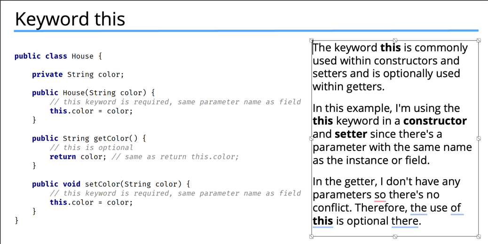
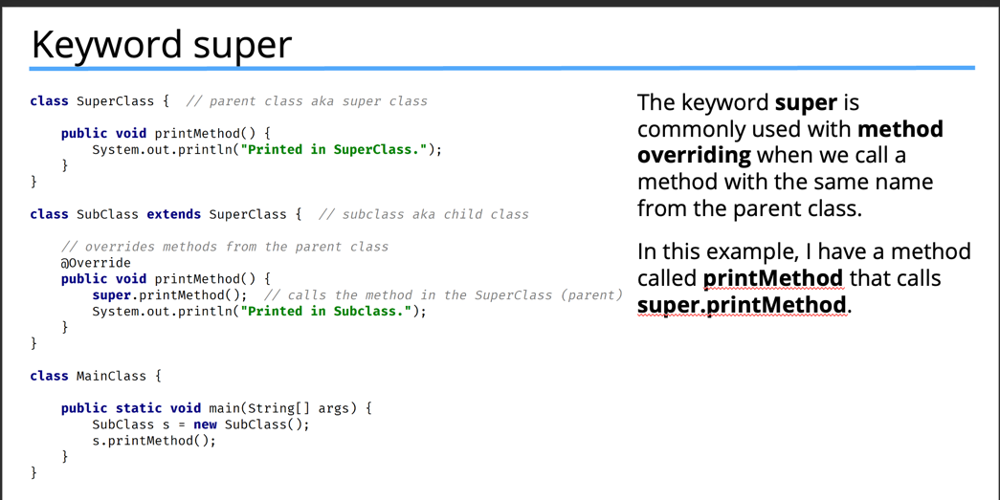
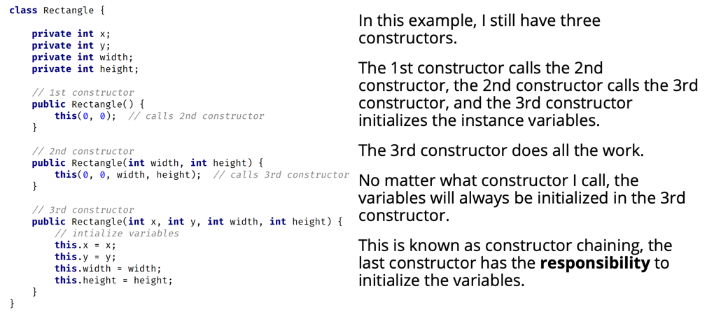
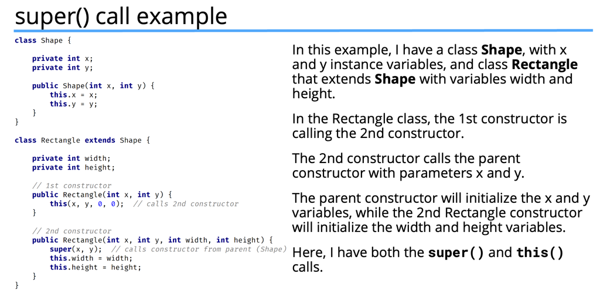

# This vs super and this() and super()
- Let's discuss the difference between the this and super keywords.
- We'll also find out about the differences between the this() and super() method calls.

## this vs super
- The keyword super is used to access or call the parent class members (both variables and methods).
- The keyword this is used to call the current class members (both variables and methods).
- this is required when we have a parameter with the same name as an instance variable or field. 
- NOTE: We can use either of these two keywords anywhere in a class except for static elements such as a static method. Any attempt to do so will lead to compile time errors. 

##  Keyword This

## Keyword Super

## this() vs super() call
- In Java, we've got the this() and super() calls.  Notice the parentheses.
- These are known as calls since they look like regular method calls although we're calling certain constructors.
- Use this() to call a constructor from another overloaded constructor in the same class.
- The call to this() can only be used in a constructor, and it must be the first statement in a constructor.
- It's used with constructor chaining, in other words, when one constructor calls another constructor, and it helps to reduce duplicated code.
- The only way to call a parent constructor is by calling super(), which calls the parent constructor.
- The Java compiler puts a default call to super() if we don't add it, and it's always a call to the no argument constructor, which is inserted by the compiler.
- The call to super() must be the first statement in each constructor.
- A constructor can have a call to super() or this(), but never both.

