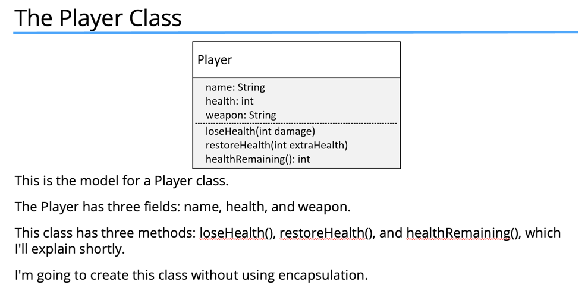

# Encapsulation
- Encapsulation means hiding things by making them private or inaccessible

## Why you want to hide things??
- To make the interface simpler, we may want to hide unnecessary details.
- To protect the integrity of data on an object, we may hide or restrict access to some of the data and operations.
- To decouple the published interface from the internal details of the class, we may hide actual names and types of class members.

### Note : here interface doesn't means actual interface but those methods which are accessible of not.

### Problem One
- Allowing direct access to data on an object can potentially bypass checks and additional processing your class has in place to manage the data.

### Problem Two
- Allowing direct access to fields means calling code would need to change when you edit any of the fields.

### Problem Three
- Omitting a constructor that would accept initialization data means the calling code is responsible for setting up this data on the new object.

## Benefits of Encapsulation
- That's really one of the huge benefits of encapsulation. Changes made do not affect any other code.
- It's like a black box in many ways.
- But the enhanced player class has full control over its data.

## Stay in control
This is why you want to use encapsulation.
- We protect the members of the class and some methods from external access.
- This prevents calling code from bypassing the rules and constraints we've built into the class.
- When I create a new instance, it's initialized with valid data.
- But likewise, I'm also making sure that there's no direct access to the fields.
- That's why you want to always use encapsulation.
- It's something that you should really get used to and use.

## Encapsulation Principles
To create an encapsulated class, you want to:
 - Create constructors for object initialization, which enforces that only objects with valid data will get created.
 - Use the private access modifier for your fields.
 - Use setter methods sparingly and only as needed.
 - Use access modifiers that aren't private, only for the methods that the calling code needs to use.

