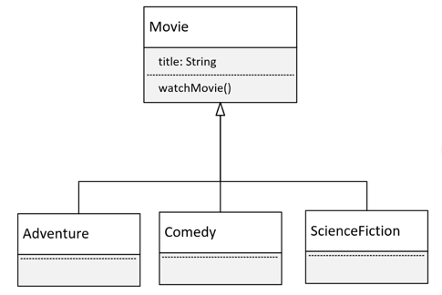
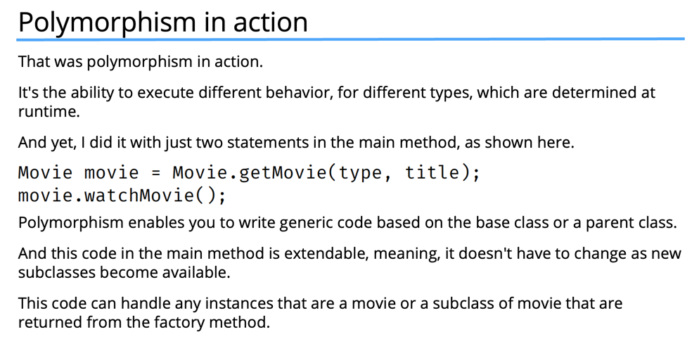

# Polymorphism
- Simply, polymorphism means many forms

## Type of Polymorphism (Run-time Polymorphism)
- Polymorphism in Java allows us to write code that can call a method, but the actual method that gets executed can be different for different objects at runtime.
- This means that the behavior that occurs during program execution depends on the runtime type of the object, which might differ from its declared type in the code.
- For polymorphism to work, the declared type must have a relationship with the runtime type. Inheritance is one way to establish this relationship, where a subclass can override a method from its superclass, enabling polymorphic behavior.
- There are other mechanisms to achieve polymorphism, but in this discussion, we’ll focus on using inheritance to support polymorphism.

### Example 
- This time, we're going to look at a polymorphism example using movies.
- I'll have a base class of Movie, which has the title of the movie.
- And Movie will have one method, watchMovie.
- 
- 
