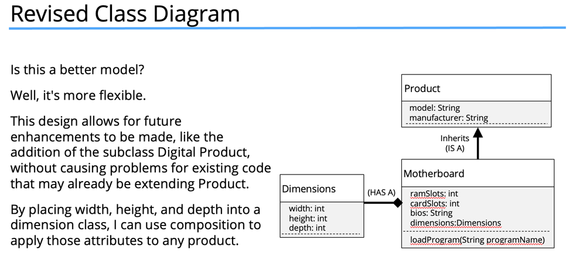

# Composition
Composition is another component of object-oriented programming.

### Inheritance
- In this instance, I have a base class called Product.
- All of my computer parts are going to inherit from Product.
- All my parts will then have the same base set of attributes: manufacturer, model, and dimensions. The width, height, and depth, in other words.
- All of these items are products, a particular type of Product.

## Inheritance vs. Composition
- Inheritance defines an <b>IS A</b> relationship.    
- Composition defines a <b>HAS A</b> relationship.
- Inheritance is a way to reuse functionality and attributes.
- Composition is a way to make the combination of classes act like a single coherent object.

- To keep this diagram simple, PersonalComputer inherits from Product.
- But a Personal Computer, in addition to being a product, is actually made up of other parts.
- Composition is actually modeling parts, and those parts make up a greater whole.
- In this case, I'm going to model the personal computer.
- And I'm modeling the has a relationship with the motherboard, the case, and the monitor.

#### Personal Computer

- This will be my personal computer, and I've said it inherits from Product.
- But it also has 3 fields, which are classes: these are Monitor, Motherboard, and ComputerCase.

## Why is Composition preferred over Inheritance in many designs?
- The reasons composition is preferred over inheritance:
  - Composition is more flexible. You can add parts in or remove them, and these changes are less likely to have a downstream effect.
  - Composition provides functional reuse outside of the class hierarchy, meaning classes can share attributes & behavior, by having similar components, instead of inheriting functionality from a parent or base class.
  - Java's inheritance breaks encapsulation because subclasses may need direct access to a parent's state or behavior.

## Why is Inheritance less flexible?
- Inheritance is less flexible.
- Adding a class to or removing a class from a class hierarchy may impact all subclasses from that point.
- In addition, a new subclass may not need all the functionality or attributes of its parent class.

#### If i want to add a digital product , would digital product extend product?? No, Digital product will not have dimensions

