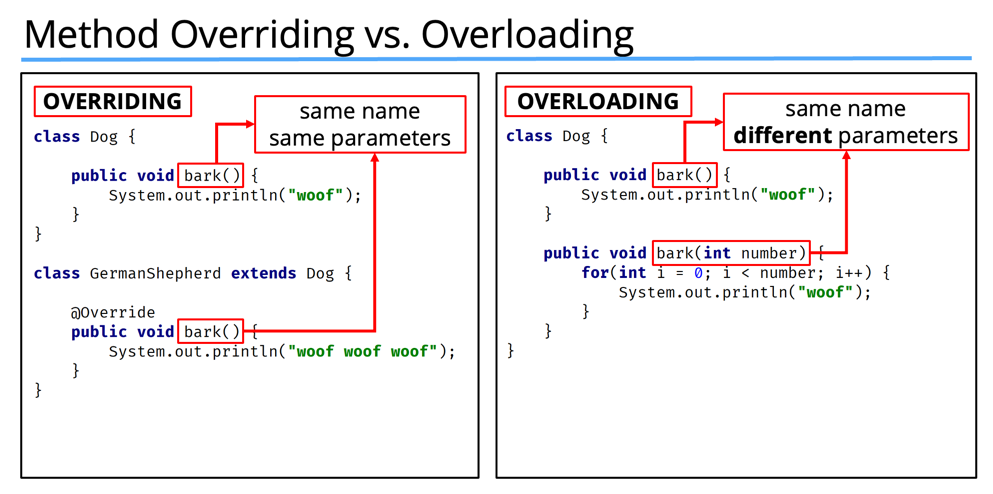
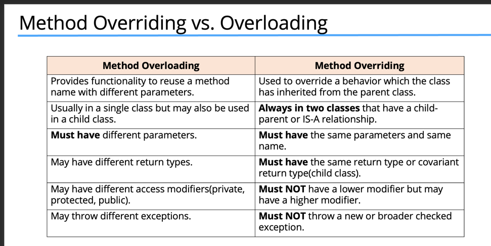

# Method Overriding vs Overloading

## Method  Overloading
- Method overloading means providing two or more separate methods in a class with the same name but different parameters.
- Method return type may or may not be different, and that allows us to reuse the same method name.
- Overloading is very handy, it reduces duplicated code, and we don't have to remember multiple method names.
- We can overload static or instance methods.
- Usually overloading happens within a single class.But methods can also be overloaded by subclasses.
### Note : Java developers often refer to method overloading, as compile-time polymorphism.

### Over loading rules
- Methods will be considered overloaded if both methods follow the following rules:
   - Methods must have the same method name.
   - Methods must have different parameters.
- If methods follow the rules above:
   - They may or may not have different return types.
   - They may or may not have different access modifiers.
   - They may or may not throw different checked or unchecked exceptions

## Method  Overriding
- Method overriding, means defining a method in a child class that already exists in the parent class, with the same signature (the same name, same parameters).
- By extending the parent class, the child class gets all the methods defined in the parent class. Those methods are also known as derived methods.
- Method overriding is also known as Runtime Polymorphism or Dynamic Method Dispatch because the method that is going to be called is decided at runtime by the Java virtual machine.
- When we override a method, it's recommended to put @Override immediately above the method definition.
- The @Override statement is not required, but it's a way to get the compiler to flag an error if you don't actually properly override this method.
- We'll get an error if we don't follow the overriding rules correctly.
- We can't override static methods, only instance methods can be overridden.

### OverRiding rules
- A method will be considered overridden if we follow these rules.
  - It must have the same name and same arguments.
  - The return type can be a subclass of the return type in the parent class.
  - It can't have a lower access modifier. In other words, it can't have more restrictive access privileges.
  - For example, if the parent's method is protected, then using private in the child's overridden method is not allowed.  However, using public for the child's method would be allowed, in this example.

- There's also some important points about method overriding to keep in mind.
  - Only inherited methods can be overridden, in other words, methods can be overridden only in child classes.
  - Constructors and private methods cannot be overridden.
  - Methods that are final cannot be overridden.
  - A subclass can use super.methodName() to call the superclass version of an overridden method.

