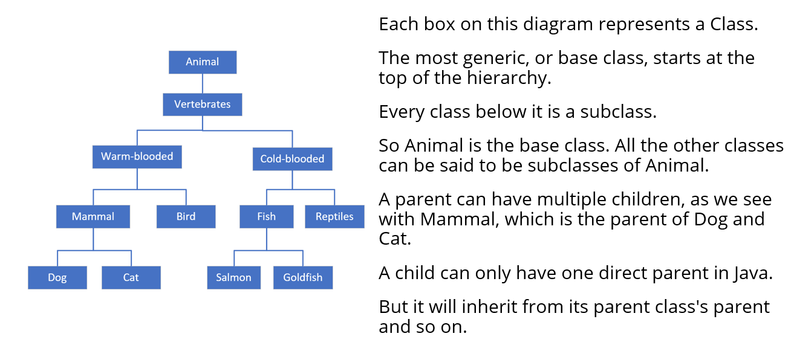
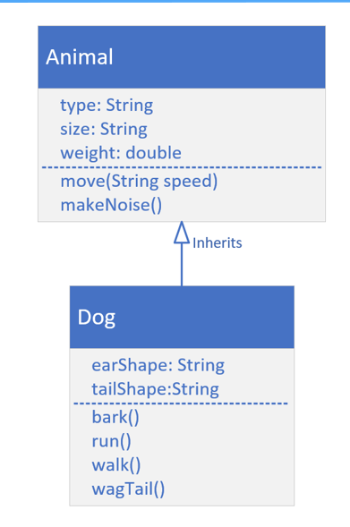

# Inheritance
- What is Inheritance, and why is it so powerful?
- We can look at Inheritance as a form of code reuse.
- It's a way to organize classes into a parent-child hierarchy, which lets the child inherit (reuse), fields and methods from its parent.

### Now we have animal kingdom, Animal is the parent class through which other animals extends

### Example Dog extends Animal class

- Here animal class has basic functionalities whereas Dog class has extended functionalities.
- Dog inherits functionalities from Animal class and has its own features as well.

### How do we extend Dog class from Animal class

## Extends
- Using <b>extends</b> specifies the superclass (or the parent class) of the class we're declaring.
- I can say Dog is a subclass or child class of Animal.
- I can say Animal is a parent or super class of Dog.
- A class can specify one and only one class in its extends clause. 

        class Dog extends Animal {
        }

## Not if you don't have a default constructor then you have to call the constructor of parent class explicitly.
## How do you call parents constructor using Super

## Super
- <b>super()</b> is a lot like this().
- It's a way to call a constructor on the super class directly from the sub class's constructor.
- Like this(), it has to be the first statement of the constructor.
- Because of that rule, this() and super() can never be called from the same constructor.

- If you don't make a call to super(), then Java makes it for you using super's default constructor. 
- If your super class doesn't have a default constructor, then you must explicitly call super() in all of your constructors, passing the right arguments to that constructor.

## Code Re-use
- All subclasses can execute methods even though the code is declared on the parent class.
- The code doesn't have to be duplicated in each subclass.
- We can use code from the parent.
- Or we can change that code for the subclass.

## Overriding a method
- Overriding a method is when you create a method on a subclass, which has the same signature as a method on a super class.
- You override a parent class method when you want the child class to show different behavior for that method.

## What are the things we can achieve using Overridden method
- The overridden method can do one of three things: 
  - It can implement completely different behavior, overriding the behavior of the parent.
  - It can simply call the parent class's method, which is somewhat redundant to do.
  - Or the method can call the parent class's method and include other code to run so it can extend the functionality for the Dog, for that behavior.
