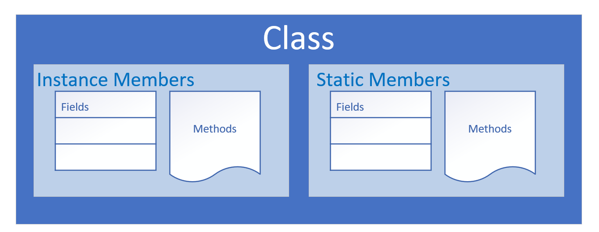
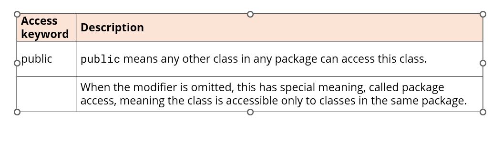
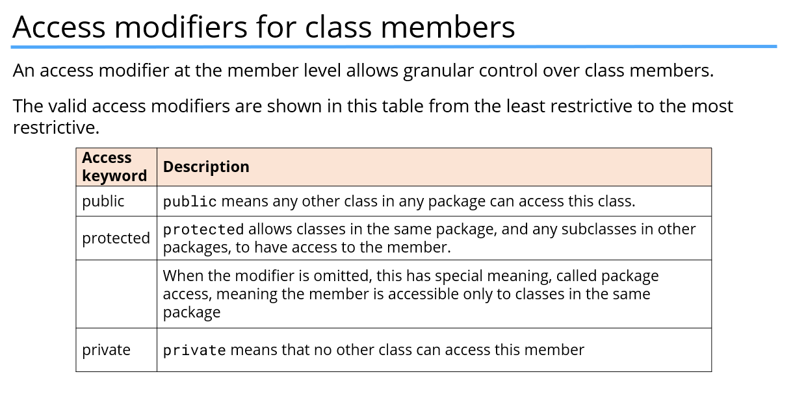

# OOP (Object-Oriented programming)

- OOP is a way to model real-world objects as software objects which contains both data and code.
- OOP is acronym for Object-Oriented programming.
- Sometimes it is called Class-Based programming

## Class-based programming
- It starts with classes which becomes the blueprints for objects 

- Modelling real-world objects as software objects is a fundamental part of Object-oriented programming.
- A software objects stores its state in fields. which can also be called variables or attributes.
- Objects expose their behaviour with methods.
### Class
- Class is like template or blueprint for creating objects.
- The class describes the data (fields), and the behavior (methods), that are relevant to the real-world object we want to describe
- These are called class members.
- A class member can be a field or a method, or some other type of dependent element.
- If a field is static, there is only one copy in memory, and this value is associated with the class or template itself.

 

- If a field is not static, it's called an instance field, and each object may have a different value stored for this field.
- A static method can't be dependent on any one object's state, so it can't reference any instance members.
- In other words, any method that operates on instance fields needs to be non-static.

### Organizing classes
- Classes can be organized into logical groupings which are called packages. 
- You declare a package name in the class using the package statement.
- If you don't declare a package, the class implicitly belongs to the default package.

### Access modifiers for the class

- A class is said to be a top-level class if it is defined in the source code file and not enclosed in the code block of another class, type, or method.
- A top-level class has only two valid access modifier options: public or none.

- 

### Encapsulation 
- Encapsulation in Object-Oriented Programming usually has two meanings.
- One is the bundling of behavior and attributes on a single object.
- The other is the practice of hiding fields and some methods from public access

### Getter and setters 
- A Getter is the method on a class that retrieves the value of  private field and return it.
- A Setter is a method on a class that sets the value of a private field
- The purpose of these methods are to protect and control access to private fields