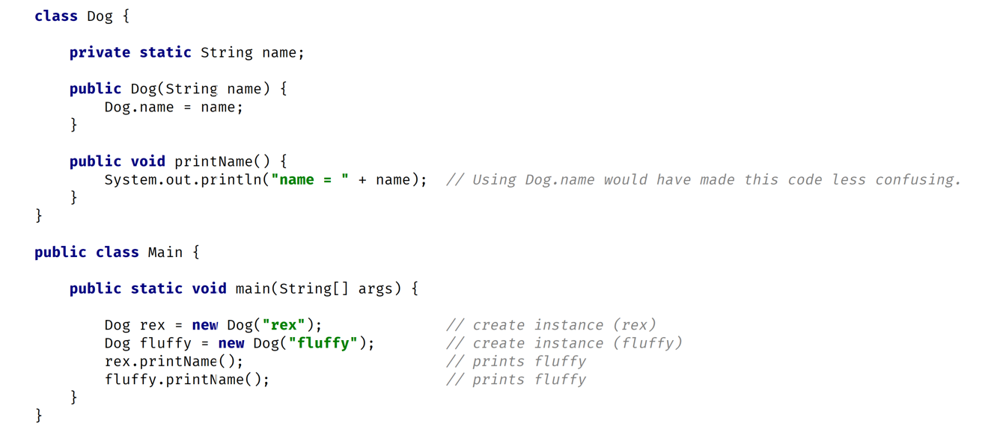
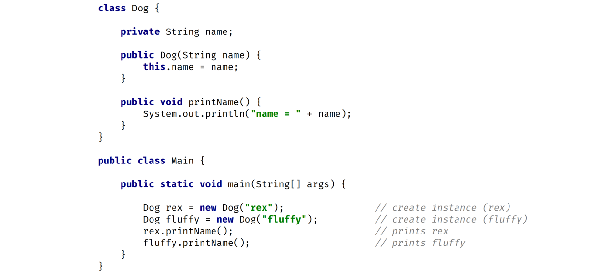

## Static vs Instance variable

### Static
- Declared by using the keyword <b> static </b>.
- Static variables are also known as static member variables.
- Every instance of the class shares the same static variables.
- If changes are made to the variable, all other instances of the class will see the effect of the change.

        class Dog {
            static String genus = "Canis";
        
            void printData(){
                Dog d = new Dog();
                System.out.println(d.genus);        //Confusing!
                System.out.println(Dog.genus);  //Clearer
            }
        }

#### Note : We use class directly for accessing static variable rather than creating the instance.

- An instance isn't required to exist to access the value of a static variable.

### Usage of static
- aren't often used but can be useful sometimes.
- They can be used:
  - Storing counters
  - Generating Unique ID's 
  - Storing a constant value that doesn't change, like IP.
  - creating and controlling access to the shared resources.

## Instance variable
- They don't use the static keyword.
- They're also known as fields or member variables.
- Instance variables belong to a specific instance of a class.
- Each instance has its own copy of an instance variable.
- Every instance can have a different value.
- Instance variables represent the state of a specific instance of a class.

## Static vs Instance method

### Static method 
- Static method are declared using static keyword.
- Static method can't access instance methods or instance variable directly.
- They're usually used for operations that don't require any data from an instance of the class (<b> from 'this'</b>)
- In static method you cannot use this keyword.
- In a method where we dont use instance variable , you should probably declare them as static.

### Instance method
- They belong to a instance of a class.
- To use a instance method, we need to create an instance of a class , usually by <b>new</b> keyword.
- It can access instance as well as static method and variable directly.