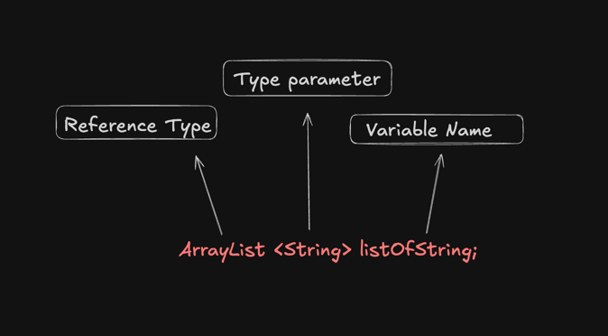

# Generic
- Generics enable us to create and design classes in a generalized manner ,without being concerned about the specific details of 
the elements they might contain.
- Examples : ArrayList is generic
- Java supports generic types , such as classes, records and interface. It supports generic methods 

### Declaring a Class vs Declaring a generic class

- The class declaration  has angle brackets with a T in them, directly after the class name.
- T is the placeholder for a type that will be specified later
- This is called a Type Identifier, and it can be any letter or word, but T is the short form of Type is commonly used.

-- Regular clas 

    class ITellyou {
        private String field;
    }

-- Generic class

    class YouTellMe<T> {
        private T field;
    }

#### Example : 

    public class Team<T> {
    
        private String teamName;
        private List<T>  teamMembers = new ArrayList<>();
        private int totalWins = 0;
        private int totalLosses = 0 ;
        private int toalDraws = 0;
    
        public Team(String teamName) {
            this.teamName = teamName;
        }
    
        public void addTeamMember ( T player)
        {
            if( !teamMembers.contains(player))
            {
                teamMembers.add(player);
            }
        }
    
        public void listTeamMember() {
            System.out.println( teamName + " Roaster: ");
            System.out.println( teamMembers);
        }
    }

### Note : This is a generic class bu there is an issue here it works with any generic but our generic should only be Player , currently it might work with string etc

    public class Team<T extends Player> {

- This sets a upper bound 

### why is it important?
- An Upper bound permits access to the bounded type's functionalities.
- An upper bound limits the kind of type parameter you can use when using a generic class. The type used must be equal to or subtype of the bounded type.
