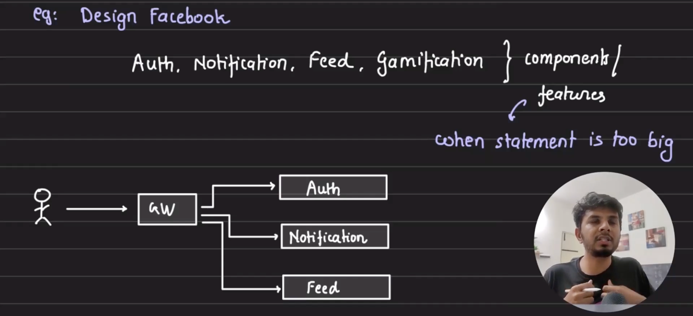
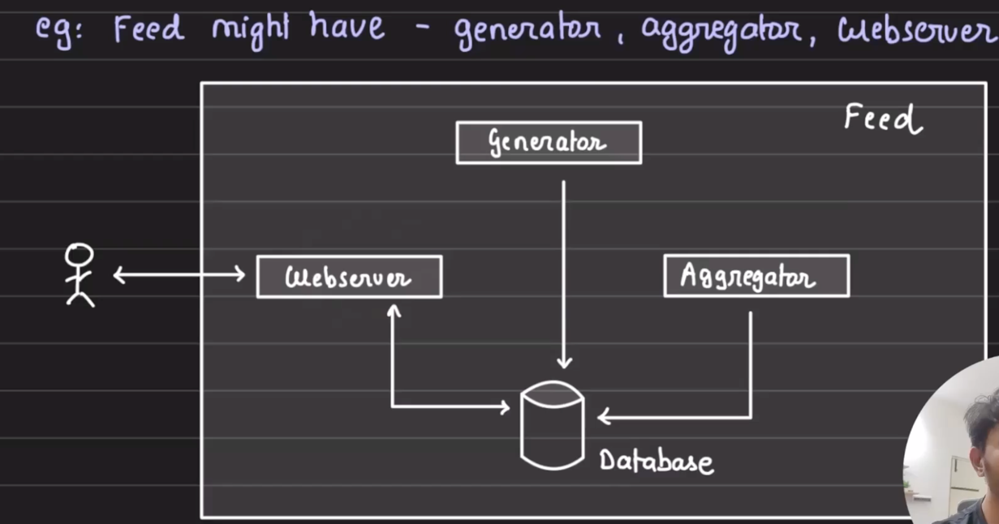
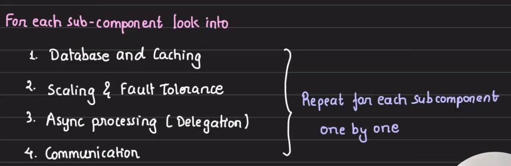
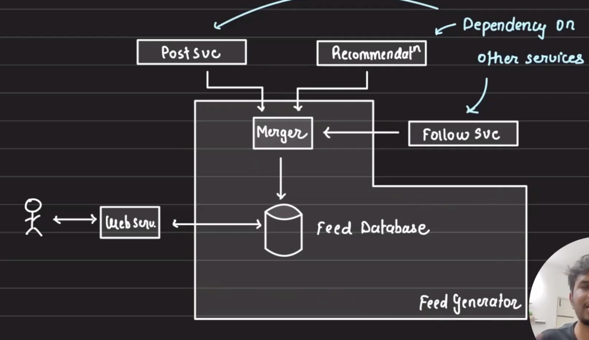

# How to approach System design?
- SD is extremely practical.
#### Always take baby steps

## Steps 

- ### Understand the problem statement
    
        Without having a thorough understanding of the problem at the hand we would easily digress      

- ### Break it down into components (essential)
        Note : do not create components for the sake of it 
        Note : create components that you know you must
        eg : Design Facebook

- ### Dissect each components (if required)
      eg : Feed might have - generator, aggregator and webserver

- In the above diagram , you need webserver to communicate with user.
- Generator is needed to generate their feeds
- Aggregator might be used for filtering or grouping the feeds , but hey if you are not sure then we can come back to it later

For each sub-components look into : 

- we need to identify the type of database and where to cache it (i.e in the server ,database or frontend)
- How to make it scalable and how fault-tolerant it will be.
- how would you handle async tasks
- how these components will contact with each other (TCP , UDP , HTTPS , grpc , websockets etc)

### But wait how will generator work? we might need to break it down further i guess

- Feed generator works, it might need follow svc (which gets people you follow)
- Recommendation will find the recommendable content
- post svc will get the details after feed generator and recommendation
- then merger merges them and stores it into a temporary DB

### Ways to approach System design
- when we want to design a big system , we go bottom down approach 
- when we want to design a specific system, we go bottom ups approach
